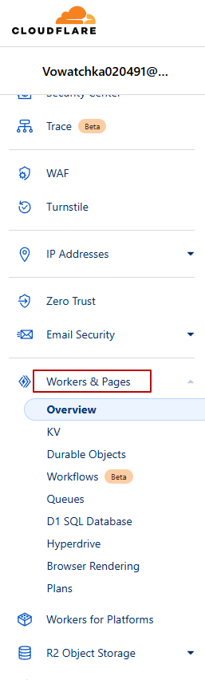

# flet_happy_new_year
Анимированное поздравление с Новым Годом на [Flet](https://flet.dev/).

Попробовать: https://flet-happy-new-year.pages.dev/ 

## Установка
```bash
pip install -r requirements.txt
```

## Запуск локально
```bash
flet run --web main.py
```

## Деплой
Деплой выполняется через [Cloudflare](https://dash.cloudflare.com/). Деплой инициализируется при пушах в репозиторий.

Управление проектами и деплоем выполняется через интерфейс Cloudflare в `Workers & Pages` на панели слева.



Деплой настроен по [инструкции](https://flet.dev/docs/publish/web/static-website/hosting/cloudflare/) из официальной документации по Flet.

Чтобы после деплоя приложение работало на Cloudflare должны соблюдаться несколько условий:
* файл, который указывается в команде `flet publish`, должен находиться в корне репозитория. Например, `main.py`
* в этом файле должен быть запуск приложения без `if __name__ == "__main__"`

  Правильно:
  ```python
  import flet as ft
  
  # You app code ...
  
  ft.app(target=main, view=ft.AppView.WEB_BROWSER)
  ```
  
  Неправильно:
  ```python
  import flet as ft
  
  # You app code ...
  
  if __name__ == "__main__": 
    ft.app(target=main, view=ft.AppView.WEB_BROWSER)
  ```
* в функцию `flet.app` обязательно нужно передать аргумент `view=ft.AppView.WEB_BROWSER`
